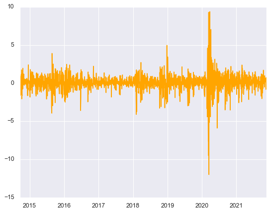
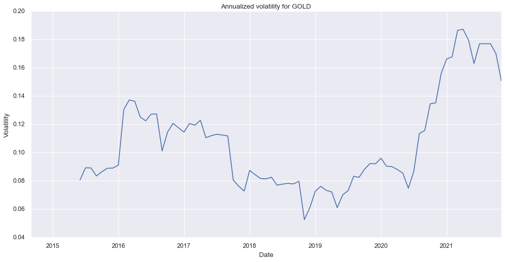

# Report: Where our found should invest in?
Descriptive Analysis of the returns and volatility of the most well-known instruments

In this report we will try to answer premises regarding the returns and volatility of Bitcoin (BTC), Gold and S&P500 index, from September 2014 to November 2021. We will see its differences, similarities, and compare them (mainly in the case of the BTC) with the CPI (inflation).

At the end, we will give our recommendations on how to proceed in creating the porfolio, taking into consideration some premises.

The chapters of this report will be according to this following questions:
1. How does the performance of Bitcoin compare to the S&P 500 and the price of gold?
2. Analyze Bitcoin's returns and volatility profile. Do you believe it could help improve the performance of a portfolio? Do you believe Bitcoin could be used as a hedge versus inflation?
3. The CFO is looking to lower volatility in the fund. Explore building a portfolio using some or all of these assets. Make a recommendation that minimizes overall risk.


----
__Before starting, we import everything, and we start with the Data Summary (checking the datatypes and we look for NULL, mainly).__


```python
import pandas as pd
bitcoin = pd.read_csv('dataset/bitcoin-usd.csv', parse_dates=['date'])
bitcoin.head()
```

<table border="1" class="dataframe">
  <thead>
    <tr style="text-align: right;">
      <th></th>
      <th>date</th>
      <th>open</th>
      <th>high</th>
      <th>low</th>
      <th>close</th>
      <th>volume</th>
    </tr>
  </thead>
  <tbody>
    <tr>
      <th>0</th>
      <td>2014-09-17</td>
      <td>465.864014</td>
      <td>468.174011</td>
      <td>452.421997</td>
      <td>457.334015</td>
      <td>21056800.0</td>
    </tr>
    <tr>
      <th>1</th>
      <td>2014-09-18</td>
      <td>456.859985</td>
      <td>456.859985</td>
      <td>413.104004</td>
      <td>424.440002</td>
      <td>34483200.0</td>
    </tr>
    <tr>
      <th>2</th>
      <td>2014-09-19</td>
      <td>424.102997</td>
      <td>427.834991</td>
      <td>384.532013</td>
      <td>394.795990</td>
      <td>37919700.0</td>
    </tr>
    <tr>
      <th>3</th>
      <td>2014-09-20</td>
      <td>394.673004</td>
      <td>423.295990</td>
      <td>389.882996</td>
      <td>408.903992</td>
      <td>36863600.0</td>
    </tr>
    <tr>
      <th>4</th>
      <td>2014-09-21</td>
      <td>408.084991</td>
      <td>412.425995</td>
      <td>393.181000</td>
      <td>398.821014</td>
      <td>26580100.0</td>
    </tr>
  </tbody>
</table>
</div>


```python
sp500 = pd.read_csv('dataset/sp500.csv', parse_dates=['date'])
sp500.head()
```


<table border="1" class="dataframe">
  <thead>
    <tr style="text-align: right;">
      <th></th>
      <th>date</th>
      <th>open</th>
      <th>high</th>
      <th>low</th>
      <th>close</th>
      <th>volume</th>
    </tr>
  </thead>
  <tbody>
    <tr>
      <th>0</th>
      <td>2014-09-17</td>
      <td>1999.300049</td>
      <td>2010.739990</td>
      <td>1993.290039</td>
      <td>2001.569946</td>
      <td>3209420000</td>
    </tr>
    <tr>
      <th>1</th>
      <td>2014-09-18</td>
      <td>2003.069946</td>
      <td>2012.339966</td>
      <td>2003.069946</td>
      <td>2011.359985</td>
      <td>3235340000</td>
    </tr>
    <tr>
      <th>2</th>
      <td>2014-09-19</td>
      <td>2012.739990</td>
      <td>2019.260010</td>
      <td>2006.589966</td>
      <td>2010.400024</td>
      <td>4880220000</td>
    </tr>
    <tr>
      <th>3</th>
      <td>2014-09-22</td>
      <td>2009.079956</td>
      <td>2009.079956</td>
      <td>1991.010010</td>
      <td>1994.290039</td>
      <td>3349670000</td>
    </tr>
    <tr>
      <th>4</th>
      <td>2014-09-23</td>
      <td>1992.780029</td>
      <td>1995.410034</td>
      <td>1982.770020</td>
      <td>1982.770020</td>
      <td>3279350000</td>
    </tr>
  </tbody>
</table>
</div>


```python
monthly_data = pd.read_csv('dataset/monthly_data.csv', parse_dates=['date'])
monthly_data.head()
```


<div>

<table border="1" class="dataframe">
  <thead>
    <tr style="text-align: right;">
      <th></th>
      <th>date</th>
      <th>gold_usd</th>
      <th>cpi_us</th>
    </tr>
  </thead>
  <tbody>
    <tr>
      <th>0</th>
      <td>2014-09-01</td>
      <td>1241.330</td>
      <td>237.852</td>
    </tr>
    <tr>
      <th>1</th>
      <td>2014-10-01</td>
      <td>1223.565</td>
      <td>238.031</td>
    </tr>
    <tr>
      <th>2</th>
      <td>2014-11-01</td>
      <td>1176.413</td>
      <td>237.433</td>
    </tr>
    <tr>
      <th>3</th>
      <td>2014-12-01</td>
      <td>1200.440</td>
      <td>236.151</td>
    </tr>
    <tr>
      <th>4</th>
      <td>2015-01-01</td>
      <td>1249.333</td>
      <td>234.812</td>
    </tr>
  </tbody>
</table>
</div>

```python
import matplotlib.pyplot as plt
import seaborn as sns
sns.set_theme()
import numpy as np
import math
import pandas as pd
```

## S&P500


```python
sp500.info()
```

    <class 'pandas.core.frame.DataFrame'>
    RangeIndex: 1805 entries, 0 to 1804
    Data columns (total 6 columns):
     #   Column  Non-Null Count  Dtype         
    ---  ------  --------------  -----         
     0   date    1805 non-null   datetime64[ns]
     1   open    1805 non-null   float64       
     2   high    1805 non-null   float64       
     3   low     1805 non-null   float64       
     4   close   1805 non-null   float64       
     5   volume  1805 non-null   int64         
    dtypes: datetime64[ns](1), float64(4), int64(1)
    memory usage: 84.7 KB
    

## BTC


```python
bitcoin.info()
```

    <class 'pandas.core.frame.DataFrame'>
    RangeIndex: 2619 entries, 0 to 2618
    Data columns (total 6 columns):
     #   Column  Non-Null Count  Dtype         
    ---  ------  --------------  -----         
     0   date    2619 non-null   datetime64[ns]
     1   open    2615 non-null   float64       
     2   high    2615 non-null   float64       
     3   low     2615 non-null   float64       
     4   close   2615 non-null   float64       
     5   volume  2615 non-null   float64       
    dtypes: datetime64[ns](1), float64(5)
    memory usage: 122.9 KB
    


```python
BTCNullDates=bitcoin[bitcoin.open.isnull()==True].date
BTCNullDates
```


    2039   2020-04-17
    2214   2020-10-09
    2217   2020-10-12
    2218   2020-10-13
    Name: date, dtype: datetime64[ns]


## Gold & CPI


```python
monthly_data.info()
```

    <class 'pandas.core.frame.DataFrame'>
    RangeIndex: 87 entries, 0 to 86
    Data columns (total 3 columns):
     #   Column    Non-Null Count  Dtype         
    ---  ------    --------------  -----         
     0   date      87 non-null     datetime64[ns]
     1   gold_usd  87 non-null     float64       
     2   cpi_us    87 non-null     float64       
    dtypes: datetime64[ns](1), float64(2)
    memory usage: 2.2 KB
    

## Summary
- GOLD & CIP are expressed in monthly values, and they have no NULL values.
- SP500 is expressed in daily values, and have no NULL values.
- BTC is also expressed in daily values, and have 4 NULL values. However, 4 over 2619 values make no statistical significance.  

All the values are already expressed as FLOAT and the dates as datetime. No modifications will be required

----------
# 1. How does the performance of Bitcoin compare to the S&P 500 and the price of gold?

## S&P500

We will start analyzing the variations of S&P500


```python
sp500.describe()
```


<div>

<table border="1" class="dataframe">
  <thead>
    <tr style="text-align: right;">
      <th></th>
      <th>open</th>
      <th>high</th>
      <th>low</th>
      <th>close</th>
      <th>volume</th>
      <th>day</th>
      <th>month</th>
      <th>year</th>
      <th>return_SP500</th>
      <th>%var</th>
    </tr>
  </thead>
  <tbody>
    <tr>
      <th>count</th>
      <td>1805.000000</td>
      <td>1805.000000</td>
      <td>1805.000000</td>
      <td>1805.000000</td>
      <td>1.805000e+03</td>
      <td>1805.000000</td>
      <td>1805.000000</td>
      <td>1805.000000</td>
      <td>1804.000000</td>
      <td>1804.000000</td>
    </tr>
    <tr>
      <th>mean</th>
      <td>2755.938758</td>
      <td>2769.524277</td>
      <td>2741.245103</td>
      <td>2756.455533</td>
      <td>3.844502e+09</td>
      <td>15.739612</td>
      <td>6.627147</td>
      <td>2017.784488</td>
      <td>0.000535</td>
      <td>0.053476</td>
    </tr>
    <tr>
      <th>std</th>
      <td>698.212835</td>
      <td>701.268104</td>
      <td>695.674679</td>
      <td>698.850564</td>
      <td>9.781460e+08</td>
      <td>8.755157</td>
      <td>3.425325</td>
      <td>2.088821</td>
      <td>0.011239</td>
      <td>1.123918</td>
    </tr>
    <tr>
      <th>min</th>
      <td>1833.400024</td>
      <td>1847.000000</td>
      <td>1810.099976</td>
      <td>1829.079956</td>
      <td>1.296540e+09</td>
      <td>1.000000</td>
      <td>1.000000</td>
      <td>2014.000000</td>
      <td>-0.119841</td>
      <td>-11.984055</td>
    </tr>
    <tr>
      <th>25%</th>
      <td>2123.159912</td>
      <td>2129.870117</td>
      <td>2114.719971</td>
      <td>2124.290039</td>
      <td>3.254950e+09</td>
      <td>8.000000</td>
      <td>4.000000</td>
      <td>2016.000000</td>
      <td>-0.003170</td>
      <td>-0.317023</td>
    </tr>
    <tr>
      <th>50%</th>
      <td>2664.439941</td>
      <td>2682.860107</td>
      <td>2648.870117</td>
      <td>2663.989990</td>
      <td>3.623320e+09</td>
      <td>16.000000</td>
      <td>7.000000</td>
      <td>2018.000000</td>
      <td>0.000695</td>
      <td>0.069501</td>
    </tr>
    <tr>
      <th>75%</th>
      <td>3045.750000</td>
      <td>3068.669922</td>
      <td>3012.590088</td>
      <td>3039.419922</td>
      <td>4.154240e+09</td>
      <td>23.000000</td>
      <td>10.000000</td>
      <td>2020.000000</td>
      <td>0.005264</td>
      <td>0.526389</td>
    </tr>
    <tr>
      <th>max</th>
      <td>4707.250000</td>
      <td>4718.500000</td>
      <td>4694.390137</td>
      <td>4701.700195</td>
      <td>9.878040e+09</td>
      <td>31.000000</td>
      <td>12.000000</td>
      <td>2021.000000</td>
      <td>0.093828</td>
      <td>9.382774</td>
    </tr>
  </tbody>
</table>
</div>


The mean is greater than the median (50%), so the distribution is positively skewed.
This is a common scenario for stocks.
Also, we will be dealing with 1805 values, and the STD (standard) deviation of the close price is 698. This number gives us an idea of the volatility.

### Close Price
We start analyzing the different closing prices along the years


```python
sns.lineplot(data=sp500, x="date", y="close")
```


    <AxesSubplot:xlabel='date', ylabel='close'>


    

    


We see that the price has been going up. However we see two falls, one right before 2019, and the other one at the begining of the pandemic in 2020.


```python
#We split the date in columns for easier analysis
sp500['day'] = sp500['date'].dt.day
sp500['month'] = sp500['date'].dt.month
sp500['year'] = sp500['date'].dt.year
```


```python
#We calculate the daily return, as the variation in percentage from closing prices comparing X day with X-1.
sp500['return_SP500']=sp500['close'].pct_change()
```


```python
sp500.set_index('date',inplace=True)
sp500
```


<div>

<table border="1" class="dataframe">
  <thead>
    <tr style="text-align: right;">
      <th></th>
      <th>open</th>
      <th>high</th>
      <th>low</th>
      <th>close</th>
      <th>volume</th>
      <th>day</th>
      <th>month</th>
      <th>year</th>
      <th>return_SP500</th>
    </tr>
    <tr>
      <th>date</th>
      <th></th>
      <th></th>
      <th></th>
      <th></th>
      <th></th>
      <th></th>
      <th></th>
      <th></th>
      <th></th>
    </tr>
  </thead>
  <tbody>
    <tr>
      <th>2014-09-17</th>
      <td>1999.300049</td>
      <td>2010.739990</td>
      <td>1993.290039</td>
      <td>2001.569946</td>
      <td>3209420000</td>
      <td>17</td>
      <td>9</td>
      <td>2014</td>
      <td>NaN</td>
    </tr>
    <tr>
      <th>2014-09-18</th>
      <td>2003.069946</td>
      <td>2012.339966</td>
      <td>2003.069946</td>
      <td>2011.359985</td>
      <td>3235340000</td>
      <td>18</td>
      <td>9</td>
      <td>2014</td>
      <td>0.004891</td>
    </tr>
    <tr>
      <th>2014-09-19</th>
      <td>2012.739990</td>
      <td>2019.260010</td>
      <td>2006.589966</td>
      <td>2010.400024</td>
      <td>4880220000</td>
      <td>19</td>
      <td>9</td>
      <td>2014</td>
      <td>-0.000477</td>
    </tr>
    <tr>
      <th>2014-09-22</th>
      <td>2009.079956</td>
      <td>2009.079956</td>
      <td>1991.010010</td>
      <td>1994.290039</td>
      <td>3349670000</td>
      <td>22</td>
      <td>9</td>
      <td>2014</td>
      <td>-0.008013</td>
    </tr>
    <tr>
      <th>2014-09-23</th>
      <td>1992.780029</td>
      <td>1995.410034</td>
      <td>1982.770020</td>
      <td>1982.770020</td>
      <td>3279350000</td>
      <td>23</td>
      <td>9</td>
      <td>2014</td>
      <td>-0.005777</td>
    </tr>
    <tr>
      <th>...</th>
      <td>...</td>
      <td>...</td>
      <td>...</td>
      <td>...</td>
      <td>...</td>
      <td>...</td>
      <td>...</td>
      <td>...</td>
      <td>...</td>
    </tr>
    <tr>
      <th>2021-11-09</th>
      <td>4707.250000</td>
      <td>4708.529785</td>
      <td>4670.870117</td>
      <td>4685.250000</td>
      <td>3110230000</td>
      <td>9</td>
      <td>11</td>
      <td>2021</td>
      <td>-0.003499</td>
    </tr>
    <tr>
      <th>2021-11-10</th>
      <td>4670.259766</td>
      <td>4684.850098</td>
      <td>4630.859863</td>
      <td>4646.709961</td>
      <td>3581630000</td>
      <td>10</td>
      <td>11</td>
      <td>2021</td>
      <td>-0.008226</td>
    </tr>
    <tr>
      <th>2021-11-11</th>
      <td>4659.390137</td>
      <td>4664.549805</td>
      <td>4648.310059</td>
      <td>4649.270020</td>
      <td>2623140000</td>
      <td>11</td>
      <td>11</td>
      <td>2021</td>
      <td>0.000551</td>
    </tr>
    <tr>
      <th>2021-11-12</th>
      <td>4655.240234</td>
      <td>4688.470215</td>
      <td>4650.770020</td>
      <td>4682.850098</td>
      <td>2865790000</td>
      <td>12</td>
      <td>11</td>
      <td>2021</td>
      <td>0.007223</td>
    </tr>
    <tr>
      <th>2021-11-15</th>
      <td>4689.299805</td>
      <td>4697.419922</td>
      <td>4672.859863</td>
      <td>4682.799805</td>
      <td>2618980000</td>
      <td>15</td>
      <td>11</td>
      <td>2021</td>
      <td>-0.000011</td>
    </tr>
  </tbody>
</table>
<p>1805 rows × 9 columns</p>
</div>


```python
# If you want only to select the first day of the month
# firstDayssp500=sp500.set_index('date').resample('BMS').first()

#We compute the difference between the closing price at the very first day of each month
#firstDayssp500['close_diff'] = firstDayssp500['close'].diff()

#We compute the percentage difference between the closing price at the very first day of each month
#firstDayssp500['close_diff_perc'] = firstDayssp500['close'].pct_change()
```

We calculate the return of the SP500 per month


```python
#We agroup the AVG percentage difference for each Month
monthSP500Summary=sp500.groupby(['year','month'])[['return_SP500']].sum()
monthSP500Summary
```


<div>

<table border="1" class="dataframe">
  <thead>
    <tr style="text-align: right;">
      <th></th>
      <th></th>
      <th>return_SP500</th>
    </tr>
    <tr>
      <th>year</th>
      <th>month</th>
      <th></th>
    </tr>
  </thead>
  <tbody>
    <tr>
      <th rowspan="4" valign="top">2014</th>
      <th>9</th>
      <td>-0.014469</td>
    </tr>
    <tr>
      <th>10</th>
      <td>0.024408</td>
    </tr>
    <tr>
      <th>11</th>
      <td>0.024312</td>
    </tr>
    <tr>
      <th>12</th>
      <td>-0.003205</td>
    </tr>
    <tr>
      <th>2015</th>
      <th>1</th>
      <td>-0.030419</td>
    </tr>
    <tr>
      <th>...</th>
      <th>...</th>
      <td>...</td>
    </tr>
    <tr>
      <th rowspan="5" valign="top">2021</th>
      <th>7</th>
      <td>0.023055</td>
    </tr>
    <tr>
      <th>8</th>
      <td>0.028881</td>
    </tr>
    <tr>
      <th>9</th>
      <td>-0.048037</td>
    </tr>
    <tr>
      <th>10</th>
      <td>0.067431</td>
    </tr>
    <tr>
      <th>11</th>
      <td>0.016783</td>
    </tr>
  </tbody>
</table>
<p>87 rows × 1 columns</p>
</div>


<i> We see that in some months the return is positive, while in others the return is negative

We calculate the return of the SP500 per year


```python
#We agroup the AVG percentage difference for each Year
#yearSP500Summary=firstDayssp500.groupby(['year'])[['close_diff_perc']].mean()
yearSP500Summary=sp500.groupby(['year'])[['return_SP500']].sum()
yearSP500Summary
```


<div>

<table border="1" class="dataframe">
  <thead>
    <tr style="text-align: right;">
      <th></th>
      <th>return_SP500</th>
    </tr>
    <tr>
      <th>year</th>
      <th></th>
    </tr>
  </thead>
  <tbody>
    <tr>
      <th>2014</th>
      <td>0.031047</td>
    </tr>
    <tr>
      <th>2015</th>
      <td>0.004678</td>
    </tr>
    <tr>
      <th>2016</th>
      <td>0.099646</td>
    </tr>
    <tr>
      <th>2017</th>
      <td>0.179757</td>
    </tr>
    <tr>
      <th>2018</th>
      <td>-0.049921</td>
    </tr>
    <tr>
      <th>2019</th>
      <td>0.261588</td>
    </tr>
    <tr>
      <th>2020</th>
      <td>0.210538</td>
    </tr>
    <tr>
      <th>2021</th>
      <td>0.227381</td>
    </tr>
  </tbody>
</table>
</div>


```python
totalSPReturn=yearSP500Summary.sum()
print('The Total return the S%P500 registered between the period {} & {}, was of {:.2f}%'. 
format(sp500.index.min(),sp500.index.max(),totalSPReturn[0]*100))
```

    The Total return the S%P500 registered between the period 2014-09-17 00:00:00 & 2021-11-15 00:00:00, was of 96.47%
    

### Volatility
With the study of the volatility, we will be able to analyze how big can be the difference across the 'close' prices. With this we will get the risk involved. 
Why risk? Because a wider possibility of values, means I could easily lose a lot of money. This doesn't mean that it will be forever, but in a period of time, it might happen. And, of course, this might impact in the horizon I would like to develop to my portfolio.

But, be carefoul, with bigger risks (big looses), come bigger earnings.

With the following graphic we will see the different returns per year in bars


```python
yearSP500Summary['return_SP500'].plot(kind='bar')
plt.show()
```


    

    


We can see that expect in 2018, all the years have a positive return


```python
# compute volatility using Pandas rolling and std methods, the trading days is set to 252 days
TRADING_DAYS = 252
returns = np.log(sp500['close']/sp500['close'].shift(1))
returns.fillna(0, inplace=True)
volatility = returns.rolling(window=TRADING_DAYS).std()*np.sqrt(TRADING_DAYS)

fig = plt.figure(figsize=(15, 7))
ax1 = fig.add_subplot(1, 1, 1)
volatility.plot(ax=ax1)
ax1.set_xlabel('Date')
ax1.set_ylabel('Volatility')
ax1.set_title('Annualized volatility for SP500')
plt.show()
```


    

    


As we can see the volatility started decreasing in the period 2016:2018.
However the biggest impact was at the beginning of the pandemic, and the high volatility lasted almost a year.


```python
#We create the column of % of variation from the index of variation
sp500['%var']=sp500['return_SP500']*100
```


```python
# Plot the price returns
plt.plot(sp500['%var'], color = 'orange')
plt.show()

# Calculate daily std of returns
sp500_std_daily = sp500['%var'].std()
print('Daily volatility: ', '{:.2f}%'.format(sp500_std_daily))

# Convert daily volatility to monthly volatility
sp500_std_monthly = math.sqrt(21) * sp500_std_daily
print ('Monthly volatility: ', '{:.2f}%'.format(sp500_std_monthly))

# Convert daily volatility to annaul volatility
sp500_std_annual = math.sqrt(252) * sp500_std_daily
print ('Annual volatility: ', '{:.2f}%'.format(sp500_std_annual))
```


    

    


    Daily volatility:  1.12%
    Monthly volatility:  5.15%
    Annual volatility:  17.84%
    

We can see that the Annual volatility is relativatly low. Nevertheless, during the period 2020-2021 we can see an increase in this value.


```python
#We agroup the AVG percentage difference for each Month
monthSP500Summary['volatility_SP500']=sp500.groupby(['year','month'])[['%var']].std()*math.sqrt(21)
monthSP500Summary['return_SP500']=monthSP500Summary['return_SP500']*100
monthSP500Summary
```


<div>

<table border="1" class="dataframe">
  <thead>
    <tr style="text-align: right;">
      <th></th>
      <th></th>
      <th>return_SP500</th>
      <th>volatility_SP500</th>
    </tr>
    <tr>
      <th>year</th>
      <th>month</th>
      <th></th>
      <th></th>
    </tr>
  </thead>
  <tbody>
    <tr>
      <th rowspan="4" valign="top">2014</th>
      <th>9</th>
      <td>-1.446910</td>
      <td>3.655450</td>
    </tr>
    <tr>
      <th>10</th>
      <td>2.440812</td>
      <td>5.277742</td>
    </tr>
    <tr>
      <th>11</th>
      <td>2.431242</td>
      <td>1.178990</td>
    </tr>
    <tr>
      <th>12</th>
      <td>-0.320462</td>
      <td>4.463606</td>
    </tr>
    <tr>
      <th>2015</th>
      <th>1</th>
      <td>-3.041873</td>
      <td>4.909043</td>
    </tr>
    <tr>
      <th>...</th>
      <th>...</th>
      <td>...</td>
      <td>...</td>
    </tr>
    <tr>
      <th rowspan="5" valign="top">2021</th>
      <th>7</th>
      <td>2.305459</td>
      <td>3.396485</td>
    </tr>
    <tr>
      <th>8</th>
      <td>2.888090</td>
      <td>2.383673</td>
    </tr>
    <tr>
      <th>9</th>
      <td>-4.803656</td>
      <td>3.671159</td>
    </tr>
    <tr>
      <th>10</th>
      <td>6.743122</td>
      <td>3.132615</td>
    </tr>
    <tr>
      <th>11</th>
      <td>1.678251</td>
      <td>2.036620</td>
    </tr>
  </tbody>
</table>
<p>87 rows × 2 columns</p>
</div>


```python
#We agroup the AVG percentage difference for each Month
yearSP500Summary['volatility_SP500']=sp500.groupby(['year'])[['%var']].std()*math.sqrt(212)
yearSP500Summary['return_SP500']=yearSP500Summary['return_SP500']*100
yearSP500Summary
```


<div>

<table border="1" class="dataframe">
  <thead>
    <tr style="text-align: right;">
      <th></th>
      <th>return_SP500</th>
      <th>volatility_SP500</th>
    </tr>
    <tr>
      <th>year</th>
      <th></th>
      <th></th>
    </tr>
  </thead>
  <tbody>
    <tr>
      <th>2014</th>
      <td>3.104681</td>
      <td>12.848009</td>
    </tr>
    <tr>
      <th>2015</th>
      <td>0.467803</td>
      <td>14.210976</td>
    </tr>
    <tr>
      <th>2016</th>
      <td>9.964615</td>
      <td>12.010800</td>
    </tr>
    <tr>
      <th>2017</th>
      <td>17.975739</td>
      <td>6.132142</td>
    </tr>
    <tr>
      <th>2018</th>
      <td>-4.992090</td>
      <td>15.639818</td>
    </tr>
    <tr>
      <th>2019</th>
      <td>26.158788</td>
      <td>11.439470</td>
    </tr>
    <tr>
      <th>2020</th>
      <td>21.053817</td>
      <td>31.580373</td>
    </tr>
    <tr>
      <th>2021</th>
      <td>22.738089</td>
      <td>11.422415</td>
    </tr>
  </tbody>
</table>
</div>


## GOLD


```python
monthly_data.describe()
```


<div>

<table border="1" class="dataframe">
  <thead>
    <tr style="text-align: right;">
      <th></th>
      <th>gold_usd</th>
      <th>cpi_us</th>
      <th>gold_usd_diff</th>
      <th>return_Gold</th>
      <th>day</th>
      <th>month</th>
      <th>year</th>
      <th>%_var</th>
    </tr>
  </thead>
  <tbody>
    <tr>
      <th>count</th>
      <td>87.000000</td>
      <td>87.000000</td>
      <td>86.000000</td>
      <td>86.000000</td>
      <td>87.0</td>
      <td>87.000000</td>
      <td>87.000000</td>
      <td>86.000000</td>
    </tr>
    <tr>
      <th>mean</th>
      <td>1403.186678</td>
      <td>249.790759</td>
      <td>6.325233</td>
      <td>0.004875</td>
      <td>1.0</td>
      <td>6.620690</td>
      <td>2017.781609</td>
      <td>0.487480</td>
    </tr>
    <tr>
      <th>std</th>
      <td>257.985374</td>
      <td>10.733951</td>
      <td>55.651219</td>
      <td>0.036174</td>
      <td>0.0</td>
      <td>3.474965</td>
      <td>2.120911</td>
      <td>3.617373</td>
    </tr>
    <tr>
      <th>min</th>
      <td>1068.317000</td>
      <td>233.707000</td>
      <td>-139.100000</td>
      <td>-0.072679</td>
      <td>1.0</td>
      <td>1.000000</td>
      <td>2014.000000</td>
      <td>-7.267882</td>
    </tr>
    <tr>
      <th>25%</th>
      <td>1231.081500</td>
      <td>240.428500</td>
      <td>-21.798000</td>
      <td>-0.017084</td>
      <td>1.0</td>
      <td>4.000000</td>
      <td>2016.000000</td>
      <td>-1.708377</td>
    </tr>
    <tr>
      <th>50%</th>
      <td>1283.189000</td>
      <td>249.554000</td>
      <td>1.739000</td>
      <td>0.001343</td>
      <td>1.0</td>
      <td>7.000000</td>
      <td>2018.000000</td>
      <td>0.134312</td>
    </tr>
    <tr>
      <th>75%</th>
      <td>1577.216000</td>
      <td>257.091000</td>
      <td>35.982000</td>
      <td>0.027068</td>
      <td>1.0</td>
      <td>10.000000</td>
      <td>2020.000000</td>
      <td>2.706791</td>
    </tr>
    <tr>
      <th>max</th>
      <td>2041.700000</td>
      <td>276.589000</td>
      <td>200.893000</td>
      <td>0.109133</td>
      <td>1.0</td>
      <td>12.000000</td>
      <td>2021.000000</td>
      <td>10.913311</td>
    </tr>
  </tbody>
</table>
</div>


We start analyzing the different closing prices along the years


```python
sns.lineplot(data=monthly_data, x="date", y="gold_usd")
```


    <AxesSubplot:xlabel='date', ylabel='gold_usd'>


    

    


From this graphic what we can conclude is that the gold was a great 'reserve of value' during the crisis of the Pandemic. 


```python
#We compute the difference between the closing price at the very first day of each month
monthly_data['gold_usd_diff'] = monthly_data['gold_usd'].diff()

#We compute the percentage difference between the closing price at the very first day of each month
monthly_data['return_Gold'] = monthly_data['gold_usd'].pct_change()
```


```python
monthly_data['day'] = monthly_data['date'].dt.day
monthly_data['month'] = monthly_data['date'].dt.month
monthly_data['year'] = monthly_data['date'].dt.year

```


```python
monthly_data=monthly_data.set_index('date')
```


```python
#We agroup the AVG percentage difference for each Month
monthGoldSummary=monthly_data.groupby(['year','month'])[['return_Gold']].sum()
monthGoldSummary
```


<div>

<table border="1" class="dataframe">
  <thead>
    <tr style="text-align: right;">
      <th></th>
      <th></th>
      <th>return_Gold</th>
    </tr>
    <tr>
      <th>year</th>
      <th>month</th>
      <th></th>
    </tr>
  </thead>
  <tbody>
    <tr>
      <th rowspan="4" valign="top">2014</th>
      <th>9</th>
      <td>0.000000</td>
    </tr>
    <tr>
      <th>10</th>
      <td>-0.014311</td>
    </tr>
    <tr>
      <th>11</th>
      <td>-0.038537</td>
    </tr>
    <tr>
      <th>12</th>
      <td>0.020424</td>
    </tr>
    <tr>
      <th>2015</th>
      <th>1</th>
      <td>0.040729</td>
    </tr>
    <tr>
      <th>...</th>
      <th>...</th>
      <td>...</td>
    </tr>
    <tr>
      <th rowspan="5" valign="top">2021</th>
      <th>7</th>
      <td>-0.072679</td>
    </tr>
    <tr>
      <th>8</th>
      <td>0.023777</td>
    </tr>
    <tr>
      <th>9</th>
      <td>-0.000165</td>
    </tr>
    <tr>
      <th>10</th>
      <td>-0.032752</td>
    </tr>
    <tr>
      <th>11</th>
      <td>0.015991</td>
    </tr>
  </tbody>
</table>
<p>87 rows × 1 columns</p>
</div>


```python
#We agroup the AVG percentage difference for each Year
yearGoldSummary=monthly_data.groupby(['year'])[['return_Gold']].sum()
yearGoldSummary
```


<div>

<table border="1" class="dataframe">
  <thead>
    <tr style="text-align: right;">
      <th></th>
      <th>return_Gold</th>
    </tr>
    <tr>
      <th>year</th>
      <th></th>
    </tr>
  </thead>
  <tbody>
    <tr>
      <th>2014</th>
      <td>-0.032424</td>
    </tr>
    <tr>
      <th>2015</th>
      <td>-0.111174</td>
    </tr>
    <tr>
      <th>2016</th>
      <td>0.085985</td>
    </tr>
    <tr>
      <th>2017</th>
      <td>0.097563</td>
    </tr>
    <tr>
      <th>2018</th>
      <td>-0.009312</td>
    </tr>
    <tr>
      <th>2019</th>
      <td>0.174329</td>
    </tr>
    <tr>
      <th>2020</th>
      <td>0.206051</td>
    </tr>
    <tr>
      <th>2021</th>
      <td>0.008215</td>
    </tr>
  </tbody>
</table>
</div>


```python
totalGoldReturn=yearGoldSummary.sum()
print('The Total return the Gold registered between the period {} & {}, was of {:.2f}%'. 
format(monthly_data.index.min(),monthly_data.index.max(),totalGoldReturn[0]*100))
```


    return_Gold    0.419233
    dtype: float64


```python
yearGoldSummary['return_Gold'].plot(kind='bar')
plt.show()
```


    

    


From this graphic we can see that in three years, the Gold had negative returns.
While, as we explained before, in 2020 it was clearly a chosen instrument for preserving the value (at least at the beginning of the Pandemic).

#### Volatility


```python
# compute volatility using Pandas rolling and std methods, the trading days is set to 252 days
TRADING_DAYS = 10
returns = np.log(monthly_data['gold_usd']/monthly_data['gold_usd'].shift(1))
returns.fillna(0, inplace=True)
volatility = returns.rolling(window=TRADING_DAYS).std()*np.sqrt(TRADING_DAYS)

fig = plt.figure(figsize=(15, 7))
ax1 = fig.add_subplot(1, 1, 1)
volatility.plot(ax=ax1)
ax1.set_xlabel('Date')
ax1.set_ylabel('Volatility')
ax1.set_title('Annualized volatility for GOLD')
plt.show()
```


    

    


```python
monthly_data['%_var']=monthly_data['return_Gold']*100
```


```python
# Plot the price returns
plt.plot(monthly_data['%_var'], color = 'orange')
plt.show()

# Calculate daily std of returns
gold_std_monthly = monthly_data['%_var'].std()
print('Last Monthly volatility: ', '{:.2f}%'.format(gold_std_monthly))

# Convert daily volatility to annaul volatility
gold_std_annual = math.sqrt(252/21) * gold_std_monthly
print ('Last Annual volatility: ', '{:.2f}%'.format(gold_std_annual))
```


    

    


    Last Monthly volatility:  3.62%
    Last Annual volatility:  12.53%
    

We can see that the Annual volatility is relativatly low. Nevertheless, during the period 2020-2021 we can see an increase in this value.


```python
#We agroup the AVG percentage difference for each Year
yearGoldSummary['volatility_Gold']=monthly_data.groupby(['year'])[['%_var']].std()*math.sqrt(212/21)
yearGoldSummary['return_Gold']=yearGoldSummary['return_Gold']*100
yearGoldSummary
```


<div>

<table border="1" class="dataframe">
  <thead>
    <tr style="text-align: right;">
      <th></th>
      <th>return_Gold</th>
      <th>volatility_Gold</th>
    </tr>
    <tr>
      <th>year</th>
      <th></th>
      <th></th>
    </tr>
  </thead>
  <tbody>
    <tr>
      <th>2014</th>
      <td>-3.242388</td>
      <td>9.416237</td>
    </tr>
    <tr>
      <th>2015</th>
      <td>-11.117356</td>
      <td>9.403313</td>
    </tr>
    <tr>
      <th>2016</th>
      <td>8.598460</td>
      <td>13.726040</td>
    </tr>
    <tr>
      <th>2017</th>
      <td>9.756280</td>
      <td>7.725525</td>
    </tr>
    <tr>
      <th>2018</th>
      <td>-0.931160</td>
      <td>7.736442</td>
    </tr>
    <tr>
      <th>2019</th>
      <td>17.432891</td>
      <td>8.803491</td>
    </tr>
    <tr>
      <th>2020</th>
      <td>20.605064</td>
      <td>15.012257</td>
    </tr>
    <tr>
      <th>2021</th>
      <td>0.821480</td>
      <td>16.340498</td>
    </tr>
  </tbody>
</table>
</div>


## Bitcoin


```python
#We start the Bitcoin Analysis
bitcoin.describe()
```


<div>

<table border="1" class="dataframe">
  <thead>
    <tr style="text-align: right;">
      <th></th>
      <th>open</th>
      <th>high</th>
      <th>low</th>
      <th>close</th>
      <th>volume</th>
      <th>day</th>
      <th>month</th>
      <th>year</th>
      <th>return</th>
      <th>%var</th>
      <th>return_BTC</th>
    </tr>
  </thead>
  <tbody>
    <tr>
      <th>count</th>
      <td>2615.000000</td>
      <td>2615.000000</td>
      <td>2615.000000</td>
      <td>2615.000000</td>
      <td>2.615000e+03</td>
      <td>2619.000000</td>
      <td>2619.000000</td>
      <td>2619.000000</td>
      <td>2618.000000</td>
      <td>2618.000000</td>
      <td>2618.000000</td>
    </tr>
    <tr>
      <th>mean</th>
      <td>10051.643066</td>
      <td>10334.482966</td>
      <td>9750.736512</td>
      <td>10073.814423</td>
      <td>1.400155e+10</td>
      <td>15.731959</td>
      <td>6.605956</td>
      <td>2017.787705</td>
      <td>0.002635</td>
      <td>0.263500</td>
      <td>0.002635</td>
    </tr>
    <tr>
      <th>std</th>
      <td>14892.430109</td>
      <td>15326.320248</td>
      <td>14422.269302</td>
      <td>14923.069664</td>
      <td>1.993158e+10</td>
      <td>8.800823</td>
      <td>3.452026</td>
      <td>2.087648</td>
      <td>0.039025</td>
      <td>3.902489</td>
      <td>0.039025</td>
    </tr>
    <tr>
      <th>min</th>
      <td>176.897003</td>
      <td>211.731003</td>
      <td>171.509995</td>
      <td>178.102997</td>
      <td>5.914570e+06</td>
      <td>1.000000</td>
      <td>1.000000</td>
      <td>2014.000000</td>
      <td>-0.371695</td>
      <td>-37.169539</td>
      <td>-0.371695</td>
    </tr>
    <tr>
      <th>25%</th>
      <td>582.071015</td>
      <td>588.960998</td>
      <td>575.311981</td>
      <td>582.555999</td>
      <td>7.489110e+07</td>
      <td>8.000000</td>
      <td>4.000000</td>
      <td>2016.000000</td>
      <td>-0.012817</td>
      <td>-1.281712</td>
      <td>-0.012817</td>
    </tr>
    <tr>
      <th>50%</th>
      <td>5745.599121</td>
      <td>5865.881836</td>
      <td>5544.089844</td>
      <td>5750.799805</td>
      <td>4.679500e+09</td>
      <td>16.000000</td>
      <td>7.000000</td>
      <td>2018.000000</td>
      <td>0.001996</td>
      <td>0.199600</td>
      <td>0.001996</td>
    </tr>
    <tr>
      <th>75%</th>
      <td>9866.986328</td>
      <td>10136.996094</td>
      <td>9642.615235</td>
      <td>9870.199219</td>
      <td>2.287606e+10</td>
      <td>23.000000</td>
      <td>10.000000</td>
      <td>2020.000000</td>
      <td>0.018371</td>
      <td>1.837115</td>
      <td>0.018371</td>
    </tr>
    <tr>
      <th>max</th>
      <td>67549.734375</td>
      <td>68789.625000</td>
      <td>66382.062500</td>
      <td>67566.828125</td>
      <td>3.509679e+11</td>
      <td>31.000000</td>
      <td>12.000000</td>
      <td>2021.000000</td>
      <td>0.252472</td>
      <td>25.247169</td>
      <td>0.252472</td>
    </tr>
  </tbody>
</table>
</div>


### Close Price


```python
sns.lineplot(data=bitcoin, x="date", y="close")
```


    <AxesSubplot:xlabel='date', ylabel='close'>


    

    


As we can see, the BTC had it's 'boom' from 2020.
What it is really shocking it's to see how fast the price went down after reaching it's first maximum at the beginning of 2021. 


```python
sns.kdeplot(bitcoin['close'],shade=True)
```


    <AxesSubplot:xlabel='close', ylabel='Density'>


    

    


```python
bitcoin['day'] = bitcoin['date'].dt.day
bitcoin['month'] = bitcoin['date'].dt.month
bitcoin['year'] = bitcoin['date'].dt.year
```


```python
bitcoin['return_BTC']=bitcoin['close'].pct_change()
```


```python
bitcoin.set_index('date',inplace=True)
```


```python
#firstDaysBTC=bitcoin.set_index('date').resample('BMS').first()

#We compute the difference between the closing price at the very first day of each month
#firstDaysBTC['close_diff'] = firstDaysBTC['close'].diff()

#We compute the percentage difference between the closing price at the very first day of each month
#firstDaysBTC['close_diff_perc'] = firstDaysBTC['close'].pct_change()
```


```python
#We agroup the AVG percentage difference for each Month
monthBTCSummary=bitcoin.groupby(['year','month'])[['return_BTC']].sum()
monthBTCSummary
```


<div>

<table border="1" class="dataframe">
  <thead>
    <tr style="text-align: right;">
      <th></th>
      <th></th>
      <th>return_BTC</th>
    </tr>
    <tr>
      <th>year</th>
      <th>month</th>
      <th></th>
    </tr>
  </thead>
  <tbody>
    <tr>
      <th rowspan="4" valign="top">2014</th>
      <th>9</th>
      <td>-0.154446</td>
    </tr>
    <tr>
      <th>10</th>
      <td>-0.118051</td>
    </tr>
    <tr>
      <th>11</th>
      <td>0.132413</td>
    </tr>
    <tr>
      <th>12</th>
      <td>-0.157695</td>
    </tr>
    <tr>
      <th>2015</th>
      <th>1</th>
      <td>-0.299671</td>
    </tr>
    <tr>
      <th>...</th>
      <th>...</th>
      <td>...</td>
    </tr>
    <tr>
      <th rowspan="5" valign="top">2021</th>
      <th>7</th>
      <td>0.187079</td>
    </tr>
    <tr>
      <th>8</th>
      <td>0.141330</td>
    </tr>
    <tr>
      <th>9</th>
      <td>-0.050939</td>
    </tr>
    <tr>
      <th>10</th>
      <td>0.356667</td>
    </tr>
    <tr>
      <th>11</th>
      <td>-0.010983</td>
    </tr>
  </tbody>
</table>
<p>87 rows × 1 columns</p>
</div>


```python
#We agroup the AVG percentage difference for each Year
yearBTCSummary=bitcoin.groupby(['year'])[['return_BTC']].sum()
yearBTCSummary
```


<div>

<table border="1" class="dataframe">
  <thead>
    <tr style="text-align: right;">
      <th></th>
      <th>return_BTC</th>
    </tr>
    <tr>
      <th>year</th>
      <th></th>
    </tr>
  </thead>
  <tbody>
    <tr>
      <th>2014</th>
      <td>-0.297779</td>
    </tr>
    <tr>
      <th>2015</th>
      <td>0.538500</td>
    </tr>
    <tr>
      <th>2016</th>
      <td>0.922590</td>
    </tr>
    <tr>
      <th>2017</th>
      <td>3.143504</td>
    </tr>
    <tr>
      <th>2018</th>
      <td>-0.996154</td>
    </tr>
    <tr>
      <th>2019</th>
      <td>0.882330</td>
    </tr>
    <tr>
      <th>2020</th>
      <td>1.677015</td>
    </tr>
    <tr>
      <th>2021</th>
      <td>1.028430</td>
    </tr>
  </tbody>
</table>
</div>


```python
totalBTCReturn=yearBTCSummary.sum()
print('The Total return the BTC registered between the period {} & {}, was of {:.2f}%'. 
format(bitcoin.index.min(),bitcoin.index.max(),totalBTCReturn[0]*100))
```


    return_BTC    6.898436
    dtype: float64


```python
yearBTCSummary['return_BTC'].plot(kind='bar')
plt.show()
```


    

    


As we can see, except for the year 2014 and 2018, where the BTC shown a negative return, three of the other 6 periods, shown a return above 100%, and one of them above 300%.

However, in 2018 the return was almost -100% (meaning that its price went completetly down). This talks about a high volatility: big chances of winning a lot of money, and chances of losing it all.

### Volatility


```python
# compute volatility using Pandas rolling and std methods, the trading days is set to 252 days
TRADING_DAYS = 252
returns = np.log(bitcoin['close']/bitcoin['close'].shift(1))
returns.fillna(0, inplace=True)
volatility = returns.rolling(window=TRADING_DAYS).std()*np.sqrt(TRADING_DAYS)

fig = plt.figure(figsize=(15, 7))
ax1 = fig.add_subplot(1, 1, 1)
volatility.plot(ax=ax1)
ax1.set_xlabel('Date')
ax1.set_ylabel('Volatility')
ax1.set_title('Annualized volatility for Bitcoin')
plt.show()
```


    

    


The volatility here is explicit. As we were just talking in the previous point, the year 2018 was a negative year for the BTC, with a huge volatility. 


```python
bitcoin['%var']=bitcoin['return_BTC']*100
```


```python
# Plot the price returns
plt.plot(bitcoin['%var'], color = 'orange')
plt.show()

# Calculate daily std of returns
btc_std_daily = bitcoin['%var'].std()
print('Daily volatility: ', '{:.2f}%'.format(btc_std_daily))

# Convert daily volatility to monthly volatility
btc_std_monthly = math.sqrt(21) * btc_std_daily
print ('Monthly volatility: ', '{:.2f}%'.format(btc_std_monthly))

# Convert daily volatility to annaul volatility
btc_std_annual = math.sqrt(252) * btc_std_daily
print ('Annual volatility: ', '{:.2f}%'.format(btc_std_annual))
```


    

    


    Daily volatility:  3.90%
    Monthly volatility:  17.88%
    Annual volatility:  61.95%
    

We can see that the volatility is bigger than the one of the other instruments.


```python
#We agroup the AVG percentage difference for each Month
monthBTCSummary['volatility_BTC']=bitcoin.groupby(['year','month'])[['%var']].std()*math.sqrt(21)
monthBTCSummary['return_BTC']=monthBTCSummary['return_BTC']*100
monthBTCSummary
```


<div>

<table border="1" class="dataframe">
  <thead>
    <tr style="text-align: right;">
      <th></th>
      <th></th>
      <th>return_BTC</th>
      <th>volatility_BTC</th>
    </tr>
    <tr>
      <th>year</th>
      <th>month</th>
      <th></th>
      <th></th>
    </tr>
  </thead>
  <tbody>
    <tr>
      <th rowspan="4" valign="top">2014</th>
      <th>9</th>
      <td>-15.444605</td>
      <td>20.187510</td>
    </tr>
    <tr>
      <th>10</th>
      <td>-11.805149</td>
      <td>14.813896</td>
    </tr>
    <tr>
      <th>11</th>
      <td>13.241285</td>
      <td>17.860419</td>
    </tr>
    <tr>
      <th>12</th>
      <td>-15.769479</td>
      <td>10.530948</td>
    </tr>
    <tr>
      <th>2015</th>
      <th>1</th>
      <td>-29.967121</td>
      <td>33.781155</td>
    </tr>
    <tr>
      <th>...</th>
      <th>...</th>
      <td>...</td>
      <td>...</td>
    </tr>
    <tr>
      <th rowspan="5" valign="top">2021</th>
      <th>7</th>
      <td>18.707916</td>
      <td>14.273884</td>
    </tr>
    <tr>
      <th>8</th>
      <td>14.133039</td>
      <td>15.127627</td>
    </tr>
    <tr>
      <th>9</th>
      <td>-5.093908</td>
      <td>18.105096</td>
    </tr>
    <tr>
      <th>10</th>
      <td>35.666690</td>
      <td>16.109258</td>
    </tr>
    <tr>
      <th>11</th>
      <td>-1.098333</td>
      <td>12.769859</td>
    </tr>
  </tbody>
</table>
<p>87 rows × 2 columns</p>
</div>


```python
#We agroup the AVG percentage difference for each Month
yearBTCSummary['volatility_BTC']=bitcoin.groupby(['year'])[['%var']].std()*math.sqrt(212)
yearBTCSummary['return_BTC']=yearBTCSummary['return_BTC']*100
yearBTCSummary
```


<div>

<table border="1" class="dataframe">
  <thead>
    <tr style="text-align: right;">
      <th></th>
      <th>return_BTC</th>
      <th>volatility_BTC</th>
    </tr>
    <tr>
      <th>year</th>
      <th></th>
      <th></th>
    </tr>
  </thead>
  <tbody>
    <tr>
      <th>2014</th>
      <td>-29.777948</td>
      <td>48.911358</td>
    </tr>
    <tr>
      <th>2015</th>
      <td>53.849994</td>
      <td>52.426581</td>
    </tr>
    <tr>
      <th>2016</th>
      <td>92.258984</td>
      <td>36.598181</td>
    </tr>
    <tr>
      <th>2017</th>
      <td>314.350411</td>
      <td>72.683394</td>
    </tr>
    <tr>
      <th>2018</th>
      <td>-99.615418</td>
      <td>61.779910</td>
    </tr>
    <tr>
      <th>2019</th>
      <td>88.233041</td>
      <td>51.868930</td>
    </tr>
    <tr>
      <th>2020</th>
      <td>167.701489</td>
      <td>54.910628</td>
    </tr>
    <tr>
      <th>2021</th>
      <td>102.843046</td>
      <td>62.705861</td>
    </tr>
  </tbody>
</table>
</div>


## Analyzing the Combination of the instruments


```python
combinedYearSummary = pd.merge(left=yearBTCSummary, right=yearGoldSummary, left_on='year', right_on='year')
combinedYearSummary = pd.merge(left=combinedYearSummary, right=yearSP500Summary, left_on='year', right_on='year')
```


```python
#Returns per year
combinedYearSummary
```


<div>

<table border="1" class="dataframe">
  <thead>
    <tr style="text-align: right;">
      <th></th>
      <th>return_BTC</th>
      <th>volatility_BTC</th>
      <th>return_Gold</th>
      <th>volatility_Gold</th>
      <th>return_SP500</th>
      <th>volatility_SP500</th>
    </tr>
    <tr>
      <th>year</th>
      <th></th>
      <th></th>
      <th></th>
      <th></th>
      <th></th>
      <th></th>
    </tr>
  </thead>
  <tbody>
    <tr>
      <th>2014</th>
      <td>-29.777948</td>
      <td>48.911358</td>
      <td>-3.242388</td>
      <td>9.416237</td>
      <td>3.104681</td>
      <td>12.848009</td>
    </tr>
    <tr>
      <th>2015</th>
      <td>53.849994</td>
      <td>52.426581</td>
      <td>-11.117356</td>
      <td>9.403313</td>
      <td>0.467803</td>
      <td>14.210976</td>
    </tr>
    <tr>
      <th>2016</th>
      <td>92.258984</td>
      <td>36.598181</td>
      <td>8.598460</td>
      <td>13.726040</td>
      <td>9.964615</td>
      <td>12.010800</td>
    </tr>
    <tr>
      <th>2017</th>
      <td>314.350411</td>
      <td>72.683394</td>
      <td>9.756280</td>
      <td>7.725525</td>
      <td>17.975739</td>
      <td>6.132142</td>
    </tr>
    <tr>
      <th>2018</th>
      <td>-99.615418</td>
      <td>61.779910</td>
      <td>-0.931160</td>
      <td>7.736442</td>
      <td>-4.992090</td>
      <td>15.639818</td>
    </tr>
    <tr>
      <th>2019</th>
      <td>88.233041</td>
      <td>51.868930</td>
      <td>17.432891</td>
      <td>8.803491</td>
      <td>26.158788</td>
      <td>11.439470</td>
    </tr>
    <tr>
      <th>2020</th>
      <td>167.701489</td>
      <td>54.910628</td>
      <td>20.605064</td>
      <td>15.012257</td>
      <td>21.053817</td>
      <td>31.580373</td>
    </tr>
    <tr>
      <th>2021</th>
      <td>102.843046</td>
      <td>62.705861</td>
      <td>0.821480</td>
      <td>16.340498</td>
      <td>22.738089</td>
      <td>11.422415</td>
    </tr>
  </tbody>
</table>
</div>


### Graphics

__Close Price of the three instruments__


```python
bitcoin['close'].plot(label = 'BTC', figsize = (15,7))
monthly_data['gold_usd'].plot(label = "Gold")
sp500['close'].plot(label = "SP500")
plt.title('BTC Close price vs Gold vs SP500')
plt.legend()
```


    <matplotlib.legend.Legend at 0x202168afd90>


    

    


__Now, let's see the returns of the three instruments__


```python
#Returns per Instrument
bitcoin['returns'] = (bitcoin['close']/bitcoin['close'].shift(1)) -1
monthly_data['returns'] = (monthly_data['gold_usd']/monthly_data['gold_usd'].shift(1))-1
sp500['returns'] = (sp500['close']/sp500['close'].shift(1)) -1
bitcoin['returns'].plot( label = 'BTC', alpha = 0.5, figsize = (15,7))
monthly_data['returns'].plot( label = 'Gold', alpha = 0.5)
sp500['returns'].plot( label = 'SP500', alpha = 0.5)
plt.legend()
```


    <matplotlib.legend.Legend at 0x2021838ba90>


    

    


__Now, let's see graphically the volatility of the three instruments__


```python
# compute volatility using Pandas rolling and std methods, the trading days is set to 252 days
TRADING_DAYS = 252
returns = np.log(bitcoin['close']/bitcoin['close'].shift(1))
returns.fillna(0, inplace=True)
volatilityBTC = returns.rolling(window=TRADING_DAYS).std()*np.sqrt(TRADING_DAYS)

TRADING_DAYS_GOLD = 10
returnsGold = np.log(monthly_data['gold_usd']/monthly_data['gold_usd'].shift(1))
returnsGold.fillna(0, inplace=True)
volatilityGOLD = returnsGold.rolling(window=TRADING_DAYS_GOLD).std()*np.sqrt(TRADING_DAYS_GOLD)


TRADING_DAYS = 252
returnsSP500 = np.log(sp500['close']/sp500['close'].shift(1))
returnsSP500.fillna(0, inplace=True)
volatilitySP500 = returnsSP500.rolling(window=TRADING_DAYS).std()*np.sqrt(TRADING_DAYS)


fig = plt.figure(figsize=(15, 7))
ax1 = fig.add_subplot(1, 1, 1)
volatilityBTC.plot(ax=ax1,label='BTC')
volatilityGOLD.plot(ax=ax1,label='Gold')
volatilitySP500.plot(ax=ax1,label='S&P500')
ax1.set_xlabel('Date')
ax1.set_ylabel('Volatility')
ax1.set_title('Annualized volatility for the three instruments')
ax1.legend()
plt.show()
```


    

    


- As we can see, BTC has higger closing prices than the Gold and SP500.
- BTC has wider returns, having not only the absolute maximums, but also the absolute minimums.
- And, finally, if we thought S&P500 had a high volatility, is because we didn't use the same scale to put it next to the BTC graphic. The volatility BTC is big per se, but huge in comparison with the other two instruments.

__Another Graphic__


```python
combinedYearSummaryReturn=combinedYearSummary[['return_BTC','return_Gold','return_SP500']]
```


```python
ax = sns.boxplot(data=combinedYearSummaryReturn)
ax = sns.swarmplot(data=combinedYearSummaryReturn, color=".25")
```


    

    


We see long-distanced-outliers in the BTC price. This talks about a high volatility.


```python
#Returns per Instrument
bitcoin['returns'] = (bitcoin['close']/bitcoin['close'].shift(1)) -1
monthly_data['returns'] = (monthly_data['gold_usd']/monthly_data['gold_usd'].shift(1))-1
sp500['returns'] = (sp500['close']/sp500['close'].shift(1)) -1
bitcoin['returns'].hist(bins = 100, label = 'BTC', alpha = 0.5, figsize = (15,7))
monthly_data['returns'].hist(bins = 100, label = 'Gold', alpha = 0.5)
sp500['returns'].hist(bins = 100, label = 'SP500', alpha = 0.5)
plt.legend()
```


    <matplotlib.legend.Legend at 0x20216c24820>


    

    


Here we see the distribution of the returns. Gold it's almost impossible to see, taking into consideration that it is using the BTC scale to be able to fit its values in the general graphic. This mean that the Gold returns are much smaller that the BTC ones.
Also, with this graphic we can see the presence of many outliers.

SP500 has a better curve in terms of risk-taking (volatility) than BTC. It means it's a safer instrument and with good returns.


```python
print('The total return of each instrument:')
print('The return of Gold was: {:.2f}%'.format(monthly_data['returns'].sum()*100))
print('The return of BTC was: {:.2f}%'.format(bitcoin['returns'].sum()*100))
print('The return of S&P500 was: {:.2f}%'.format(sp500['returns'].sum()*100))


```

    The total return of each instrument:
    The return of Gold was: 41.92%
    The return of BTC was: 684.05%
    The return of S&P500 was: 96.47%
    

Summary: BTC reported higher return in the period than GOLD and SP500. However, it is shown that with a higher volatility (risk) involved.

----
# 2. Analyze Bitcoin's returns and volatility profile. Do you believe it could help improve the performance of a portfolio? Do you believe Bitcoin could be used as a hedge versus inflation?

BTC could help to improve the performance of any portfolio. However, due to its volatility, a higher risk must be assumed by the stakeholder.

Per year, the BTC has shown a high volatility, and only in the last years has shown outstanding returns


```python
monthBTCSummary
```


<div>

<table border="1" class="dataframe">
  <thead>
    <tr style="text-align: right;">
      <th></th>
      <th></th>
      <th>return_BTC</th>
      <th>volatility_BTC</th>
    </tr>
    <tr>
      <th>year</th>
      <th>month</th>
      <th></th>
      <th></th>
    </tr>
  </thead>
  <tbody>
    <tr>
      <th rowspan="4" valign="top">2014</th>
      <th>9</th>
      <td>-15.444605</td>
      <td>20.187510</td>
    </tr>
    <tr>
      <th>10</th>
      <td>-11.805149</td>
      <td>14.813896</td>
    </tr>
    <tr>
      <th>11</th>
      <td>13.241285</td>
      <td>17.860419</td>
    </tr>
    <tr>
      <th>12</th>
      <td>-15.769479</td>
      <td>10.530948</td>
    </tr>
    <tr>
      <th>2015</th>
      <th>1</th>
      <td>-29.967121</td>
      <td>33.781155</td>
    </tr>
    <tr>
      <th>...</th>
      <th>...</th>
      <td>...</td>
      <td>...</td>
    </tr>
    <tr>
      <th rowspan="5" valign="top">2021</th>
      <th>7</th>
      <td>18.707916</td>
      <td>14.273884</td>
    </tr>
    <tr>
      <th>8</th>
      <td>14.133039</td>
      <td>15.127627</td>
    </tr>
    <tr>
      <th>9</th>
      <td>-5.093908</td>
      <td>18.105096</td>
    </tr>
    <tr>
      <th>10</th>
      <td>35.666690</td>
      <td>16.109258</td>
    </tr>
    <tr>
      <th>11</th>
      <td>-1.098333</td>
      <td>12.769859</td>
    </tr>
  </tbody>
</table>
<p>87 rows × 2 columns</p>
</div>


```python
monthBTCSummary.plot()
```


    <AxesSubplot:xlabel='year,month'>


    

    


Monthly, the BTC it has shown a big volatility.


```python
yearBTCSummary
```


<div>

<table border="1" class="dataframe">
  <thead>
    <tr style="text-align: right;">
      <th></th>
      <th>return_BTC</th>
      <th>volatility_BTC</th>
    </tr>
    <tr>
      <th>year</th>
      <th></th>
      <th></th>
    </tr>
  </thead>
  <tbody>
    <tr>
      <th>2014</th>
      <td>-29.777948</td>
      <td>48.911358</td>
    </tr>
    <tr>
      <th>2015</th>
      <td>53.849994</td>
      <td>52.426581</td>
    </tr>
    <tr>
      <th>2016</th>
      <td>92.258984</td>
      <td>36.598181</td>
    </tr>
    <tr>
      <th>2017</th>
      <td>314.350411</td>
      <td>72.683394</td>
    </tr>
    <tr>
      <th>2018</th>
      <td>-99.615418</td>
      <td>61.779910</td>
    </tr>
    <tr>
      <th>2019</th>
      <td>88.233041</td>
      <td>51.868930</td>
    </tr>
    <tr>
      <th>2020</th>
      <td>167.701489</td>
      <td>54.910628</td>
    </tr>
    <tr>
      <th>2021</th>
      <td>102.843046</td>
      <td>62.705861</td>
    </tr>
  </tbody>
</table>
</div>


```python
yearBTCSummary.plot()
```


    <AxesSubplot:xlabel='year'>


    

    


Supposing our portfolio was made of these three instruments: GOLD, BTC & SP500:


```python
combinedTotalYearSummary = pd.merge(left=combinedYearSummary, right=yearCPISummary, left_on='year', right_on='year')
combinedTotalYearSummary
```


<div>

<table border="1" class="dataframe">
  <thead>
    <tr style="text-align: right;">
      <th></th>
      <th>return_BTC</th>
      <th>volatility_BTC</th>
      <th>return_Gold</th>
      <th>volatility_Gold</th>
      <th>return_SP500</th>
      <th>volatility_SP500</th>
      <th>%_var_CPI</th>
    </tr>
    <tr>
      <th>year</th>
      <th></th>
      <th></th>
      <th></th>
      <th></th>
      <th></th>
      <th></th>
      <th></th>
    </tr>
  </thead>
  <tbody>
    <tr>
      <th>2014</th>
      <td>-29.777948</td>
      <td>48.911358</td>
      <td>-3.242388</td>
      <td>9.416237</td>
      <td>3.104681</td>
      <td>12.848009</td>
      <td>-0.715913</td>
    </tr>
    <tr>
      <th>2015</th>
      <td>53.849994</td>
      <td>52.426581</td>
      <td>-11.117356</td>
      <td>9.403313</td>
      <td>0.467803</td>
      <td>14.210976</td>
      <td>0.508540</td>
    </tr>
    <tr>
      <th>2016</th>
      <td>92.258984</td>
      <td>36.598181</td>
      <td>8.598460</td>
      <td>13.726040</td>
      <td>9.964615</td>
      <td>12.010800</td>
      <td>1.683188</td>
    </tr>
    <tr>
      <th>2017</th>
      <td>314.350411</td>
      <td>72.683394</td>
      <td>9.756280</td>
      <td>7.725525</td>
      <td>17.975739</td>
      <td>6.132142</td>
      <td>2.183305</td>
    </tr>
    <tr>
      <th>2018</th>
      <td>-99.615418</td>
      <td>61.779910</td>
      <td>-0.931160</td>
      <td>7.736442</td>
      <td>-4.992090</td>
      <td>15.639818</td>
      <td>2.158606</td>
    </tr>
    <tr>
      <th>2019</th>
      <td>88.233041</td>
      <td>51.868930</td>
      <td>17.432891</td>
      <td>8.803491</td>
      <td>26.158788</td>
      <td>11.439470</td>
      <td>2.035762</td>
    </tr>
    <tr>
      <th>2020</th>
      <td>167.701489</td>
      <td>54.910628</td>
      <td>20.605064</td>
      <td>15.012257</td>
      <td>21.053817</td>
      <td>31.580373</td>
      <td>1.174729</td>
    </tr>
    <tr>
      <th>2021</th>
      <td>102.843046</td>
      <td>62.705861</td>
      <td>0.821480</td>
      <td>16.340498</td>
      <td>22.738089</td>
      <td>11.422415</td>
      <td>6.118012</td>
    </tr>
  </tbody>
</table>
</div>


```python
print('We see that {} out of {} times, BTC wont against inflation'.format((combinedTotalYearSummary['return_BTC']>combinedTotalYearSummary['%_var_CPI']).sum(),combinedTotalYearSummary.return_BTC.count()))

print('We see that {} out of {} times, Gold wont against inflation'.format((combinedTotalYearSummary['return_Gold']>combinedTotalYearSummary['%_var_CPI']).sum(),combinedTotalYearSummary.return_Gold.count()))
print('We see that {} out of {} times, SP wont against inflation'.format((combinedTotalYearSummary['return_SP500']>combinedTotalYearSummary['%_var_CPI']).sum(),combinedTotalYearSummary.return_SP500.count()))
```


    6


    4


    6


- We see that in 6 out of 8 times, BTC won against the inflation.
- We see that in 4 out of 8 times, GOLD won against the inflation
- We see that in 6 out of 8 times, SP500 won against the inflation.


```python
print('BTC has shown a real return of {:.2f} %'.format(combinedTotalYearSummary['return_BTC'].sum()-combinedTotalYearSummary['%_var_CPI'].sum()))
print('Gold has shown a real return of {:.2f} %'.format(combinedTotalYearSummary['return_Gold'].sum()-combinedTotalYearSummary['%_var_CPI'].sum()))
print('S&P500 has shown a real return of {:.2f} %'.format(combinedTotalYearSummary['return_SP500'].sum()-combinedTotalYearSummary['%_var_CPI'].sum()))
```

    BTC has shown a real return of 674.70 %
    Gold has shown a real return of 26.78 %
    S&P500 has shown a real return of 81.33 %
    

- All the instruments had positive real returns (minus inflation).
- The gold had an extraordinary year, in terms of returns, in the year 2020 (also 2019 was a good year).
- In fact, if it wasn't for the years 2019 and 2020, Gold would had lost against the inflation in a huge way.

## CPI Analysis


```python
monthly_data
```


<div>

<table border="1" class="dataframe">
  <thead>
    <tr style="text-align: right;">
      <th></th>
      <th>gold_usd</th>
      <th>cpi_us</th>
      <th>gold_usd_diff</th>
      <th>return_Gold</th>
      <th>day</th>
      <th>month</th>
      <th>year</th>
      <th>%_var</th>
      <th>returns</th>
      <th>cpi_us_diff</th>
      <th>cpi_us_diff_perc</th>
      <th>%_var_CPI</th>
    </tr>
    <tr>
      <th>date</th>
      <th></th>
      <th></th>
      <th></th>
      <th></th>
      <th></th>
      <th></th>
      <th></th>
      <th></th>
      <th></th>
      <th></th>
      <th></th>
      <th></th>
    </tr>
  </thead>
  <tbody>
    <tr>
      <th>2014-09-01</th>
      <td>1241.330</td>
      <td>237.852</td>
      <td>NaN</td>
      <td>NaN</td>
      <td>1</td>
      <td>9</td>
      <td>2014</td>
      <td>NaN</td>
      <td>NaN</td>
      <td>NaN</td>
      <td>NaN</td>
      <td>NaN</td>
    </tr>
    <tr>
      <th>2014-10-01</th>
      <td>1223.565</td>
      <td>238.031</td>
      <td>-17.765</td>
      <td>-0.014311</td>
      <td>1</td>
      <td>10</td>
      <td>2014</td>
      <td>-1.431126</td>
      <td>-0.014311</td>
      <td>0.179</td>
      <td>0.000753</td>
      <td>0.075257</td>
    </tr>
    <tr>
      <th>2014-11-01</th>
      <td>1176.413</td>
      <td>237.433</td>
      <td>-47.152</td>
      <td>-0.038537</td>
      <td>1</td>
      <td>11</td>
      <td>2014</td>
      <td>-3.853657</td>
      <td>-0.038537</td>
      <td>-0.598</td>
      <td>-0.002512</td>
      <td>-0.251228</td>
    </tr>
    <tr>
      <th>2014-12-01</th>
      <td>1200.440</td>
      <td>236.151</td>
      <td>24.027</td>
      <td>0.020424</td>
      <td>1</td>
      <td>12</td>
      <td>2014</td>
      <td>2.042395</td>
      <td>0.020424</td>
      <td>-1.282</td>
      <td>-0.005399</td>
      <td>-0.539942</td>
    </tr>
    <tr>
      <th>2015-01-01</th>
      <td>1249.333</td>
      <td>234.812</td>
      <td>48.893</td>
      <td>0.040729</td>
      <td>1</td>
      <td>1</td>
      <td>2015</td>
      <td>4.072923</td>
      <td>0.040729</td>
      <td>-1.339</td>
      <td>-0.005670</td>
      <td>-0.567010</td>
    </tr>
    <tr>
      <th>...</th>
      <td>...</td>
      <td>...</td>
      <td>...</td>
      <td>...</td>
      <td>...</td>
      <td>...</td>
      <td>...</td>
      <td>...</td>
      <td>...</td>
      <td>...</td>
      <td>...</td>
      <td>...</td>
    </tr>
    <tr>
      <th>2021-07-01</th>
      <td>1774.800</td>
      <td>271.696</td>
      <td>-139.100</td>
      <td>-0.072679</td>
      <td>1</td>
      <td>7</td>
      <td>2021</td>
      <td>-7.267882</td>
      <td>-0.072679</td>
      <td>2.501</td>
      <td>0.009291</td>
      <td>0.929066</td>
    </tr>
    <tr>
      <th>2021-08-01</th>
      <td>1817.000</td>
      <td>273.003</td>
      <td>42.200</td>
      <td>0.023777</td>
      <td>1</td>
      <td>8</td>
      <td>2021</td>
      <td>2.377733</td>
      <td>0.023777</td>
      <td>1.307</td>
      <td>0.004811</td>
      <td>0.481052</td>
    </tr>
    <tr>
      <th>2021-09-01</th>
      <td>1816.700</td>
      <td>273.567</td>
      <td>-0.300</td>
      <td>-0.000165</td>
      <td>1</td>
      <td>9</td>
      <td>2021</td>
      <td>-0.016511</td>
      <td>-0.000165</td>
      <td>0.564</td>
      <td>0.002066</td>
      <td>0.206591</td>
    </tr>
    <tr>
      <th>2021-10-01</th>
      <td>1757.200</td>
      <td>274.310</td>
      <td>-59.500</td>
      <td>-0.032752</td>
      <td>1</td>
      <td>10</td>
      <td>2021</td>
      <td>-3.275169</td>
      <td>-0.032752</td>
      <td>0.743</td>
      <td>0.002716</td>
      <td>0.271597</td>
    </tr>
    <tr>
      <th>2021-11-01</th>
      <td>1785.300</td>
      <td>276.589</td>
      <td>28.100</td>
      <td>0.015991</td>
      <td>1</td>
      <td>11</td>
      <td>2021</td>
      <td>1.599135</td>
      <td>0.015991</td>
      <td>2.279</td>
      <td>0.008308</td>
      <td>0.830812</td>
    </tr>
  </tbody>
</table>
<p>87 rows × 12 columns</p>
</div>


```python
#We compute the difference between the closing price at the very first day of each month
monthly_data['cpi_us_diff'] = monthly_data['cpi_us'].diff()

#We compute the percentage difference between the closing price at the very first day of each month
monthly_data['cpi_us_diff_perc'] = monthly_data['cpi_us'].pct_change()

monthly_data['%_var_CPI']=monthly_data['cpi_us_diff_perc']*100
```


```python
monthly_data
```


<div>

<table border="1" class="dataframe">
  <thead>
    <tr style="text-align: right;">
      <th></th>
      <th>gold_usd</th>
      <th>cpi_us</th>
      <th>gold_usd_diff</th>
      <th>return_Gold</th>
      <th>day</th>
      <th>month</th>
      <th>year</th>
      <th>%_var</th>
      <th>returns</th>
      <th>cpi_us_diff</th>
      <th>cpi_us_diff_perc</th>
      <th>%_var_CPI</th>
    </tr>
    <tr>
      <th>date</th>
      <th></th>
      <th></th>
      <th></th>
      <th></th>
      <th></th>
      <th></th>
      <th></th>
      <th></th>
      <th></th>
      <th></th>
      <th></th>
      <th></th>
    </tr>
  </thead>
  <tbody>
    <tr>
      <th>2014-09-01</th>
      <td>1241.330</td>
      <td>237.852</td>
      <td>NaN</td>
      <td>NaN</td>
      <td>1</td>
      <td>9</td>
      <td>2014</td>
      <td>NaN</td>
      <td>NaN</td>
      <td>NaN</td>
      <td>NaN</td>
      <td>NaN</td>
    </tr>
    <tr>
      <th>2014-10-01</th>
      <td>1223.565</td>
      <td>238.031</td>
      <td>-17.765</td>
      <td>-0.014311</td>
      <td>1</td>
      <td>10</td>
      <td>2014</td>
      <td>-1.431126</td>
      <td>-0.014311</td>
      <td>0.179</td>
      <td>0.000753</td>
      <td>0.075257</td>
    </tr>
    <tr>
      <th>2014-11-01</th>
      <td>1176.413</td>
      <td>237.433</td>
      <td>-47.152</td>
      <td>-0.038537</td>
      <td>1</td>
      <td>11</td>
      <td>2014</td>
      <td>-3.853657</td>
      <td>-0.038537</td>
      <td>-0.598</td>
      <td>-0.002512</td>
      <td>-0.251228</td>
    </tr>
    <tr>
      <th>2014-12-01</th>
      <td>1200.440</td>
      <td>236.151</td>
      <td>24.027</td>
      <td>0.020424</td>
      <td>1</td>
      <td>12</td>
      <td>2014</td>
      <td>2.042395</td>
      <td>0.020424</td>
      <td>-1.282</td>
      <td>-0.005399</td>
      <td>-0.539942</td>
    </tr>
    <tr>
      <th>2015-01-01</th>
      <td>1249.333</td>
      <td>234.812</td>
      <td>48.893</td>
      <td>0.040729</td>
      <td>1</td>
      <td>1</td>
      <td>2015</td>
      <td>4.072923</td>
      <td>0.040729</td>
      <td>-1.339</td>
      <td>-0.005670</td>
      <td>-0.567010</td>
    </tr>
    <tr>
      <th>...</th>
      <td>...</td>
      <td>...</td>
      <td>...</td>
      <td>...</td>
      <td>...</td>
      <td>...</td>
      <td>...</td>
      <td>...</td>
      <td>...</td>
      <td>...</td>
      <td>...</td>
      <td>...</td>
    </tr>
    <tr>
      <th>2021-07-01</th>
      <td>1774.800</td>
      <td>271.696</td>
      <td>-139.100</td>
      <td>-0.072679</td>
      <td>1</td>
      <td>7</td>
      <td>2021</td>
      <td>-7.267882</td>
      <td>-0.072679</td>
      <td>2.501</td>
      <td>0.009291</td>
      <td>0.929066</td>
    </tr>
    <tr>
      <th>2021-08-01</th>
      <td>1817.000</td>
      <td>273.003</td>
      <td>42.200</td>
      <td>0.023777</td>
      <td>1</td>
      <td>8</td>
      <td>2021</td>
      <td>2.377733</td>
      <td>0.023777</td>
      <td>1.307</td>
      <td>0.004811</td>
      <td>0.481052</td>
    </tr>
    <tr>
      <th>2021-09-01</th>
      <td>1816.700</td>
      <td>273.567</td>
      <td>-0.300</td>
      <td>-0.000165</td>
      <td>1</td>
      <td>9</td>
      <td>2021</td>
      <td>-0.016511</td>
      <td>-0.000165</td>
      <td>0.564</td>
      <td>0.002066</td>
      <td>0.206591</td>
    </tr>
    <tr>
      <th>2021-10-01</th>
      <td>1757.200</td>
      <td>274.310</td>
      <td>-59.500</td>
      <td>-0.032752</td>
      <td>1</td>
      <td>10</td>
      <td>2021</td>
      <td>-3.275169</td>
      <td>-0.032752</td>
      <td>0.743</td>
      <td>0.002716</td>
      <td>0.271597</td>
    </tr>
    <tr>
      <th>2021-11-01</th>
      <td>1785.300</td>
      <td>276.589</td>
      <td>28.100</td>
      <td>0.015991</td>
      <td>1</td>
      <td>11</td>
      <td>2021</td>
      <td>1.599135</td>
      <td>0.015991</td>
      <td>2.279</td>
      <td>0.008308</td>
      <td>0.830812</td>
    </tr>
  </tbody>
</table>
<p>87 rows × 12 columns</p>
</div>


```python
#We agroup the AVG percentage difference for each Month
monthCPISummary=monthly_data.groupby(['year','month'])[['%_var_CPI']].mean()
monthCPISummary
```


<div>

<table border="1" class="dataframe">
  <thead>
    <tr style="text-align: right;">
      <th></th>
      <th></th>
      <th>%_var_CPI</th>
    </tr>
    <tr>
      <th>year</th>
      <th>month</th>
      <th></th>
    </tr>
  </thead>
  <tbody>
    <tr>
      <th rowspan="4" valign="top">2014</th>
      <th>9</th>
      <td>NaN</td>
    </tr>
    <tr>
      <th>10</th>
      <td>0.075257</td>
    </tr>
    <tr>
      <th>11</th>
      <td>-0.251228</td>
    </tr>
    <tr>
      <th>12</th>
      <td>-0.539942</td>
    </tr>
    <tr>
      <th>2015</th>
      <th>1</th>
      <td>-0.567010</td>
    </tr>
    <tr>
      <th>...</th>
      <th>...</th>
      <td>...</td>
    </tr>
    <tr>
      <th rowspan="5" valign="top">2021</th>
      <th>7</th>
      <td>0.929066</td>
    </tr>
    <tr>
      <th>8</th>
      <td>0.481052</td>
    </tr>
    <tr>
      <th>9</th>
      <td>0.206591</td>
    </tr>
    <tr>
      <th>10</th>
      <td>0.271597</td>
    </tr>
    <tr>
      <th>11</th>
      <td>0.830812</td>
    </tr>
  </tbody>
</table>
<p>87 rows × 1 columns</p>
</div>


```python
#We agroup the AVG percentage difference for each Year
yearCPISummary=monthly_data.groupby(['year'])[['%_var_CPI']].sum()
yearCPISummary
```


<div>

<table border="1" class="dataframe">
  <thead>
    <tr style="text-align: right;">
      <th></th>
      <th>%_var_CPI</th>
    </tr>
    <tr>
      <th>year</th>
      <th></th>
    </tr>
  </thead>
  <tbody>
    <tr>
      <th>2014</th>
      <td>-0.715913</td>
    </tr>
    <tr>
      <th>2015</th>
      <td>0.508540</td>
    </tr>
    <tr>
      <th>2016</th>
      <td>1.683188</td>
    </tr>
    <tr>
      <th>2017</th>
      <td>2.183305</td>
    </tr>
    <tr>
      <th>2018</th>
      <td>2.158606</td>
    </tr>
    <tr>
      <th>2019</th>
      <td>2.035762</td>
    </tr>
    <tr>
      <th>2020</th>
      <td>1.174729</td>
    </tr>
    <tr>
      <th>2021</th>
      <td>6.118012</td>
    </tr>
  </tbody>
</table>
</div>


### BTC & CPI
__Monthly Analysis__

Let's analyze the return of the BTC against the inflation


```python
combinedMonthSummary = pd.merge(left=monthBTCSummary, right=monthCPISummary, left_on=['year','month'], right_on=['year','month'])
```


```python
combinedMonthSummary
```


<div>

<table border="1" class="dataframe">
  <thead>
    <tr style="text-align: right;">
      <th></th>
      <th></th>
      <th>return_BTC</th>
      <th>volatility_BTC</th>
      <th>%_var_CPI</th>
    </tr>
    <tr>
      <th>year</th>
      <th>month</th>
      <th></th>
      <th></th>
      <th></th>
    </tr>
  </thead>
  <tbody>
    <tr>
      <th rowspan="4" valign="top">2014</th>
      <th>9</th>
      <td>-15.444605</td>
      <td>20.187510</td>
      <td>NaN</td>
    </tr>
    <tr>
      <th>10</th>
      <td>-11.805149</td>
      <td>14.813896</td>
      <td>0.075257</td>
    </tr>
    <tr>
      <th>11</th>
      <td>13.241285</td>
      <td>17.860419</td>
      <td>-0.251228</td>
    </tr>
    <tr>
      <th>12</th>
      <td>-15.769479</td>
      <td>10.530948</td>
      <td>-0.539942</td>
    </tr>
    <tr>
      <th>2015</th>
      <th>1</th>
      <td>-29.967121</td>
      <td>33.781155</td>
      <td>-0.567010</td>
    </tr>
    <tr>
      <th>...</th>
      <th>...</th>
      <td>...</td>
      <td>...</td>
      <td>...</td>
    </tr>
    <tr>
      <th rowspan="5" valign="top">2021</th>
      <th>7</th>
      <td>18.707916</td>
      <td>14.273884</td>
      <td>0.929066</td>
    </tr>
    <tr>
      <th>8</th>
      <td>14.133039</td>
      <td>15.127627</td>
      <td>0.481052</td>
    </tr>
    <tr>
      <th>9</th>
      <td>-5.093908</td>
      <td>18.105096</td>
      <td>0.206591</td>
    </tr>
    <tr>
      <th>10</th>
      <td>35.666690</td>
      <td>16.109258</td>
      <td>0.271597</td>
    </tr>
    <tr>
      <th>11</th>
      <td>-1.098333</td>
      <td>12.769859</td>
      <td>0.830812</td>
    </tr>
  </tbody>
</table>
<p>87 rows × 3 columns</p>
</div>


```python
combinedMonthSummary['difference']=combinedMonthSummary['return_BTC']-combinedMonthSummary['%_var_CPI']
combinedMonthSummary=combinedMonthSummary.iloc[1:,:]
combinedMonthSummary
```


<div>

<table border="1" class="dataframe">
  <thead>
    <tr style="text-align: right;">
      <th></th>
      <th></th>
      <th>return_BTC</th>
      <th>volatility_BTC</th>
      <th>%_var_CPI</th>
      <th>difference</th>
    </tr>
    <tr>
      <th>year</th>
      <th>month</th>
      <th></th>
      <th></th>
      <th></th>
      <th></th>
    </tr>
  </thead>
  <tbody>
    <tr>
      <th rowspan="3" valign="top">2014</th>
      <th>10</th>
      <td>-11.805149</td>
      <td>14.813896</td>
      <td>0.075257</td>
      <td>-11.880406</td>
    </tr>
    <tr>
      <th>11</th>
      <td>13.241285</td>
      <td>17.860419</td>
      <td>-0.251228</td>
      <td>13.492513</td>
    </tr>
    <tr>
      <th>12</th>
      <td>-15.769479</td>
      <td>10.530948</td>
      <td>-0.539942</td>
      <td>-15.229538</td>
    </tr>
    <tr>
      <th rowspan="2" valign="top">2015</th>
      <th>1</th>
      <td>-29.967121</td>
      <td>33.781155</td>
      <td>-0.567010</td>
      <td>-29.400111</td>
    </tr>
    <tr>
      <th>2</th>
      <td>17.627373</td>
      <td>17.465681</td>
      <td>-0.470589</td>
      <td>18.097963</td>
    </tr>
    <tr>
      <th>...</th>
      <th>...</th>
      <td>...</td>
      <td>...</td>
      <td>...</td>
      <td>...</td>
    </tr>
    <tr>
      <th rowspan="5" valign="top">2021</th>
      <th>7</th>
      <td>18.707916</td>
      <td>14.273884</td>
      <td>0.929066</td>
      <td>17.778850</td>
    </tr>
    <tr>
      <th>8</th>
      <td>14.133039</td>
      <td>15.127627</td>
      <td>0.481052</td>
      <td>13.651987</td>
    </tr>
    <tr>
      <th>9</th>
      <td>-5.093908</td>
      <td>18.105096</td>
      <td>0.206591</td>
      <td>-5.300499</td>
    </tr>
    <tr>
      <th>10</th>
      <td>35.666690</td>
      <td>16.109258</td>
      <td>0.271597</td>
      <td>35.395093</td>
    </tr>
    <tr>
      <th>11</th>
      <td>-1.098333</td>
      <td>12.769859</td>
      <td>0.830812</td>
      <td>-1.929145</td>
    </tr>
  </tbody>
</table>
<p>86 rows × 4 columns</p>
</div>


As we don't have the variation of inflation of the first available month of 2014, we cannot calculate the real return of the BTC. That is why, we drop the row.


```python
totalRealReturn=combinedMonthSummary['return_BTC'].sum()-combinedMonthSummary['%_var_CPI'].sum()
totalRealReturn
```


    690.1419761351415


```python
combinedMonthSummary[combinedMonthSummary['difference']>0].info()
```

    <class 'pandas.core.frame.DataFrame'>
    MultiIndex: 49 entries, (2014, 11) to (2021, 10)
    Data columns (total 4 columns):
     #   Column          Non-Null Count  Dtype  
    ---  ------          --------------  -----  
     0   return_BTC      49 non-null     float64
     1   volatility_BTC  49 non-null     float64
     2   %_var_CPI       49 non-null     float64
     3   difference      49 non-null     float64
    dtypes: float64(4)
    memory usage: 2.5 KB
    

In 49 out of 86 cases, the monthly BTC return won against the inflation.

### Yearly Analysis


```python
combinedMonthSummary.groupby('year').sum()
```


<div>

<table border="1" class="dataframe">
  <thead>
    <tr style="text-align: right;">
      <th></th>
      <th>return_BTC</th>
      <th>volatility_BTC</th>
      <th>%_var_CPI</th>
      <th>difference</th>
    </tr>
    <tr>
      <th>year</th>
      <th></th>
      <th></th>
      <th></th>
      <th></th>
    </tr>
  </thead>
  <tbody>
    <tr>
      <th>2014</th>
      <td>-14.333343</td>
      <td>43.205263</td>
      <td>-0.715913</td>
      <td>-13.617430</td>
    </tr>
    <tr>
      <th>2015</th>
      <td>53.849994</td>
      <td>175.798044</td>
      <td>0.508540</td>
      <td>53.341454</td>
    </tr>
    <tr>
      <th>2016</th>
      <td>92.258984</td>
      <td>124.065327</td>
      <td>1.683188</td>
      <td>90.575796</td>
    </tr>
    <tr>
      <th>2017</th>
      <td>314.350411</td>
      <td>254.912340</td>
      <td>2.183305</td>
      <td>312.167106</td>
    </tr>
    <tr>
      <th>2018</th>
      <td>-99.615418</td>
      <td>218.749110</td>
      <td>2.158606</td>
      <td>-101.774024</td>
    </tr>
    <tr>
      <th>2019</th>
      <td>88.233041</td>
      <td>184.179939</td>
      <td>2.035762</td>
      <td>86.197279</td>
    </tr>
    <tr>
      <th>2020</th>
      <td>167.701489</td>
      <td>183.089250</td>
      <td>1.174729</td>
      <td>166.526761</td>
    </tr>
    <tr>
      <th>2021</th>
      <td>102.843046</td>
      <td>209.214904</td>
      <td>6.118012</td>
      <td>96.725034</td>
    </tr>
  </tbody>
</table>
</div>


```python
combinedMonthSummary.groupby('year')[['difference']].sum()
```


<div>

<table border="1" class="dataframe">
  <thead>
    <tr style="text-align: right;">
      <th></th>
      <th>difference</th>
    </tr>
    <tr>
      <th>year</th>
      <th></th>
    </tr>
  </thead>
  <tbody>
    <tr>
      <th>2014</th>
      <td>-13.617430</td>
    </tr>
    <tr>
      <th>2015</th>
      <td>53.341454</td>
    </tr>
    <tr>
      <th>2016</th>
      <td>90.575796</td>
    </tr>
    <tr>
      <th>2017</th>
      <td>312.167106</td>
    </tr>
    <tr>
      <th>2018</th>
      <td>-101.774024</td>
    </tr>
    <tr>
      <th>2019</th>
      <td>86.197279</td>
    </tr>
    <tr>
      <th>2020</th>
      <td>166.526761</td>
    </tr>
    <tr>
      <th>2021</th>
      <td>96.725034</td>
    </tr>
  </tbody>
</table>
</div>


In terms of Analysis per year, the BTC won 6 out of the 8 years of analysis, against inflation.


```python
combinedMonthSummary['difference'].sum()
```


    690.1419761351415


```python
print('The real return of the BTC investment in the period {} to {} was of {:.2f}%'.format(combinedMonthSummary.index.min(),combinedMonthSummary.index.max(),totalRealReturn))
```

    The real return of the BTC investment in the period (2014, 10) to (2021, 11) was of 690.14%
    

The ones who held BTC won 690% on top of the inflation 

<i> (Let's take into consideration that we drop September '14 as we don't have the inflation variation of that month). In the previous chaper we considered September as part of the analysis, but we didn't consider the inflation.

----
# 3. The CFO is looking to lower volatility in the fund. Explore building a portfolio using some or all of these assets. Make a recommendation that minimizes overall risk.

Before answering this question we need to ask ourselves the horizon of the investment. 
GOLD has not volatility at all, but with this also almost no return in the short term. Having this said, firstly we need to know the horizon of the invesment: Short or Long Term.


```python
combinedTotalYearSummary
```


<div>

<table border="1" class="dataframe">
  <thead>
    <tr style="text-align: right;">
      <th></th>
      <th>return_BTC</th>
      <th>volatility_BTC</th>
      <th>return_Gold</th>
      <th>volatility_Gold</th>
      <th>return_SP500</th>
      <th>volatility_SP500</th>
      <th>%_var_CPI</th>
    </tr>
    <tr>
      <th>year</th>
      <th></th>
      <th></th>
      <th></th>
      <th></th>
      <th></th>
      <th></th>
      <th></th>
    </tr>
  </thead>
  <tbody>
    <tr>
      <th>2014</th>
      <td>-29.777948</td>
      <td>48.911358</td>
      <td>-3.242388</td>
      <td>9.416237</td>
      <td>3.104681</td>
      <td>12.848009</td>
      <td>-0.715913</td>
    </tr>
    <tr>
      <th>2015</th>
      <td>53.849994</td>
      <td>52.426581</td>
      <td>-11.117356</td>
      <td>9.403313</td>
      <td>0.467803</td>
      <td>14.210976</td>
      <td>0.508540</td>
    </tr>
    <tr>
      <th>2016</th>
      <td>92.258984</td>
      <td>36.598181</td>
      <td>8.598460</td>
      <td>13.726040</td>
      <td>9.964615</td>
      <td>12.010800</td>
      <td>1.683188</td>
    </tr>
    <tr>
      <th>2017</th>
      <td>314.350411</td>
      <td>72.683394</td>
      <td>9.756280</td>
      <td>7.725525</td>
      <td>17.975739</td>
      <td>6.132142</td>
      <td>2.183305</td>
    </tr>
    <tr>
      <th>2018</th>
      <td>-99.615418</td>
      <td>61.779910</td>
      <td>-0.931160</td>
      <td>7.736442</td>
      <td>-4.992090</td>
      <td>15.639818</td>
      <td>2.158606</td>
    </tr>
    <tr>
      <th>2019</th>
      <td>88.233041</td>
      <td>51.868930</td>
      <td>17.432891</td>
      <td>8.803491</td>
      <td>26.158788</td>
      <td>11.439470</td>
      <td>2.035762</td>
    </tr>
    <tr>
      <th>2020</th>
      <td>167.701489</td>
      <td>54.910628</td>
      <td>20.605064</td>
      <td>15.012257</td>
      <td>21.053817</td>
      <td>31.580373</td>
      <td>1.174729</td>
    </tr>
    <tr>
      <th>2021</th>
      <td>102.843046</td>
      <td>62.705861</td>
      <td>0.821480</td>
      <td>16.340498</td>
      <td>22.738089</td>
      <td>11.422415</td>
      <td>6.118012</td>
    </tr>
  </tbody>
</table>
</div>


# Summary
In order to achieve a low volatility portfolio, we should definetly avoid buying cryptocurrencies (BTC in this case).

We have shown the return rates, the volatility and the coverage against inflation of all the instruments. BTC (and all the cryptos), of course apart for being fashion, has some specific characteristics that makes it valuable. One of its reasons is the descentralization, but this is another topic to discuss. Nevertheless, the risk involved in that investment might be huge for some 'stomachs'.

S&P500 has shown a big volatility in the year 2020, but, with exception of Gold, which instrument hasn't shown in? The first Pandemic year will be a year for further studies in the future as no one knew how to react as anyone knew what was going on nor what was going to happen.

Withouth any doubt, measuring by volatility first, and return after, S&P500 is the biggest winner for a medium horizon and a relativetly low volatility (risk).

Having this said, and taking into consideration that the Gold was chosen as a 'value cover', I would say that for a 5 years horizon we could get 80% of S&P500 and 20% of Gold.

----------
